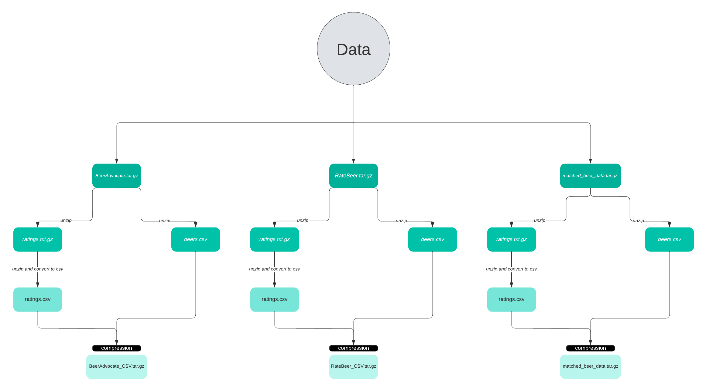

# TITLE

#### Abstract: A 150 word description of the project idea and goals. What’s the motivation behind your project? What story would you like to tell, and why?

**Are people in the US subject to give better grades for their local beers ? Are political trends reflected in the consumption of beer ?**

#### Research Questions: A list of research questions you would like to address during the project.

To address this question we should also consider answering the followings : 
- Are some states more represented than others in term of number of reviews ? Does it correlates with the consumption of beer per capita in those states ?
- Are the preferred foreign beers similar to the preferred local beers —> is there a preferred type of beer for the region ?
- How politics tendencies are spread within USA ? Can we observe trends in beer consumption related to the political tendencies ? 

#### Proposed additional datasets (if any): List the additional dataset(s) you want to use (if any), and some ideas on how you expect to get, manage, process, and enrich it/them. Show us that you’ve read the docs and some examples, and that you have a clear idea on what to expect. Discuss data size and format if relevant. It is your responsibility to check that what you propose is feasible.

We propose 4 additional datasets, all of them are relatively small but meaningfull.

1 : A table of corresponding states code following ISO-3 norm.
- This table is saved into a *US_states.csv* file.
- We need those codes to use Plotly Express, a library that helps us plot data on maps.
- Origin : Wikipedia (https://en.wikipedia.org/wiki/ISO_3166-2:US)

2 : A dataframe containing the population of the US per state and per year from year 1990 to 2020. 
- This dataframe is saved into a *US_states_population.csv* file.
- Origin : Beer Institute, Brewers Almanach 2021 (https://www.beerinstitute.org/member-portal/2020-brewers-almanac/), the dataset contains a lot of data on Beer industry in the US in general. The table has its original source from the US census.

3 : A dataframe containing the annual average beer consumption per capita for each state from year 1990 to 2020
- This dataframe is saved into a *US_states_beer_consumption_per_capita.csv* file.
- We will use this dataframe and the datas from the states population to draw information regarding the characteristics of beer consumers in the different states and thus assert some crucial points about how much the ratings are spread unevenly across the population of beer consumers in the US.
- Origin : Beer Institute, Brewers Almanach 2021 (https://www.beerinstitute.org/member-portal/2020-brewers-almanac/), the dataset contains a lot of data on Beer industry in the US in general. This dataframe more specifically is the apparent consumption per capita based on estimates of beer volume shipped to wholesalers and on the legal drinking age population by state.

4 : A dataframe with the political inclination of each state (Democratic or Republican), derived from the the winner of each presidential election in the US since year 1972.
- This datafreame has been saved into a *US_states_political_inclination.csv* file
- We will use it to answere our most important question : **Can we observe trends in beer consumption related to the political tendencies ?**, to link states beer consumption and ratings statistics to their political tendencies at the time.
- Origin : wikipedia (https://en.wikipedia.org/wiki/Red_states_and_blue_states), the table contain which candidate (Democratic or Republican) won the vote in each country for each presidential election and was therefore used to create a corresponding dataframe containing the overall political tendencies of each state for each presidential mandat. 

The detail about all these dataframes, what they look like and how we scraped the ones from wikipedia can all be found in the following jupyter notebook : *external_data_handling.ipybn*.

#### How are the Data handled ?

Our datasets are named **RateBeer.tar.gz**, **matched_beer_data.tar.gz** and **BeerAdvocate.tar.gz**. These are compressed folders containing both csv and txt files. In order to ease our analysis we created different methods to create this tree structure (does not work well in dark mode for visualisation):

#### Methods

We loaded the BeerAdvocate and RateBeer datasets for years 2001-2017. We converted the txt files into csv and compressed them back. These files are now stored into our local machines to optimize storage. We processed the data by removing every line missing an argument to have a global vision of the dataframes we could work with.
We created two different dataframes, one for each site, merging all the data we considered useful for further analysis.

### **Data description**

US_Code_User location_user US_Code_Beer beers_location beer_name beer_id brewery_name brewery_id style abv date user_name user_id appearance aroma palate taste overall rating text

| Column name          | Description                                                                                                                                                                                       |   |   |   |
|----------------------|---------------------------------------------------------------------------------------------------------------------------------------------------------------------------------------------------|---|---|---|
| US_Code_User           | Code format of the State origin of the user                                                                                                                                                |   |   |   |
| location_user            | Origin country of the user                                                                                     |   |   |   |
| US_Code_Beer | Code format of the State origin of the beer                                                                                                                |   |   |   |
| beers_location          | Origin country of the beer   |   |   |   |
| beer_name             | Beer name                                                                                                                                                                 |   |   |   |
| beer_id        | The beer ID                                                                                          |   |   |   |
| brewery_name               | The brewery name                                      |   |   |   |
| brewery_id              | The brewery ID                                                                                                                                                                     |   |   |   |
| style                 | Beer type (e.g. English Brown Ale, Indian Pale Ale, Kölsch)                                                                                                                                                     |   |   |   |
| abv                 | Alcohol by volume, standard measurement, used worldwide, to assess the strength of a particular beer.                                                                                                                                                               |   |   |   |
| date           | Date of the review                                                  |   |   |   |
| user_name               |  User alias                                                                                                                    |   |   |   |
| user_id         | User ID |   |   |   |
| appearance          | Appearance aspect score of the beer                                                                                                             |   |   |   |
| aroma               | Aroma aspect score of the beer                                                                                                        |   |   |   |
| palate               | Palate aspect score of the beer                                                                                                     |   |   |   |
| taste               | Taste aspect score of the beer                                                                                                         |   |   |   |
| overall               | Overall aspect score of the beer                                                                                                       |   |   |   |
| rating               | Score of the beer                                                                                                          |   |   |   |
| text               | Review of the user                                                                                                       |   |   |   |

Our workflow will consist in :
- Extracting the geographical informations of the beer production and relating them to the reviewers origin states
- Producing significant statististics about the number of rating within the USA as well as the number of reviwers (we aime to minimize the bias)
- Performing historical opinion analysis thanks to reviews from 2001 to 2017, it will be done by supervised learning (regression and classification)
- Identifying a subset of words that best explain a user’s review for each aspects and finding what's most valued by consumers.

#### Proposed timeline

Before November 18th :
- Data processing, visualization, creation of a dataframe containing all the information extracted from every file for each website.
- Creation of a new column containing the States name imported from Wikipedia to plot correctly a world map.
- Interactive mapping of the different beer locations and users locations, worldwide and USA centered

Before December 2d :
- Homework 2 
- Sentimental analysis of the reviews to see whether they corresponds to a positive or negative sentiment. Furthermore, we will perform emotional analysis to see the evolution of particular emotions throughout different reviews of a same user. 

multiple-aspect rating
Before December 16th :
- Principal Components Analysis (PCA) keeping 2 of the 4 beer aspects 
- Analysis of correlations between users nationalities and beer production locations
- Random forest of 10’000 trees trained to find the optimal combination of aspects
- Meaningful plots to complement the interactive maps

Before December 23d :
- Story-telling 
- Github repository cleaning and organisation
- README completion

#### Organization within the team
| Thibaut | Claire | Mathis | Achraf |
|---|---|---|---|
| External datasets handling and processing  | Data handling | Geographical correlations | Data cleaning/filtering |
| Time Series Analysis | Sentimental analysis of reviews | Random forest training | Plot interractive US maps  |
| Data Story (20%)  | Data Story (40%) | Data Story (20%) | Data Story (20%) |

#### Questions for TAs (optional): Add here any questions you have for us related to the proposed project.